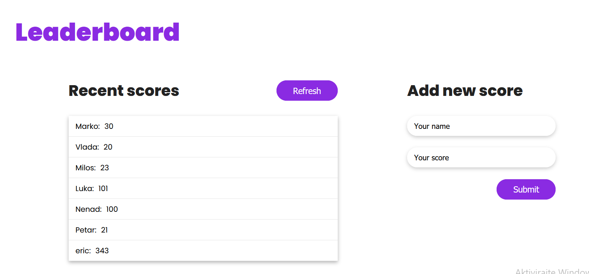

# Leaderboard Project

> This is leaderboard app.



Here you can write and save your scores.

## Setup

### Clone this repository

```bash
$ git clone https://github.com/vladanvi99/leaderboard.git
$ cd leaderboard
```

### Run project

```bash
$ npm install
$ npm run build
```
### Open page in browser
```bash
$ open dist/index.html
```

## Built With

- HTML
- CSS
- JS

## Live Demo

Live will be soon.

## Authors

👤 **Author1**

- GitHub: [@githubhandle](https://github.com/vladanvi99)
- Twitter: [@twitterhandle](https://twitter.com/vladanvi99)
- LinkedIn: [LinkedIn](https://www.linkedin.com/in/vladan-videnovi%C4%87-780bb11b2/)


## 🤝 Contributing

Contributions, issues, and feature requests are welcome!

Feel free to check the [issues page](../../issues/).

## Show your support

Give a ⭐️ if you like this project!


